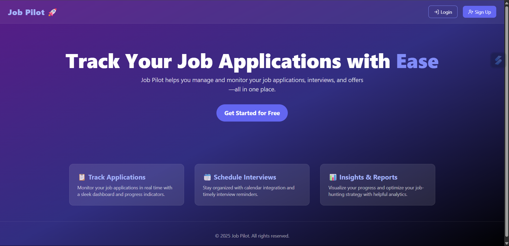
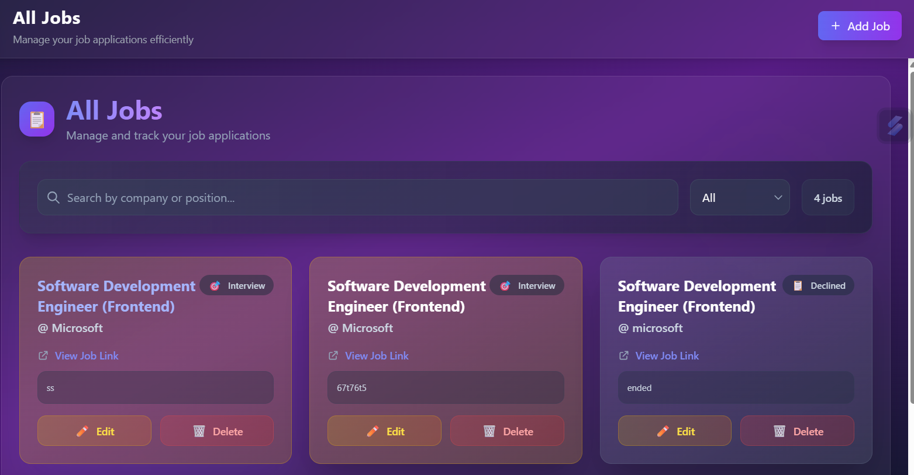
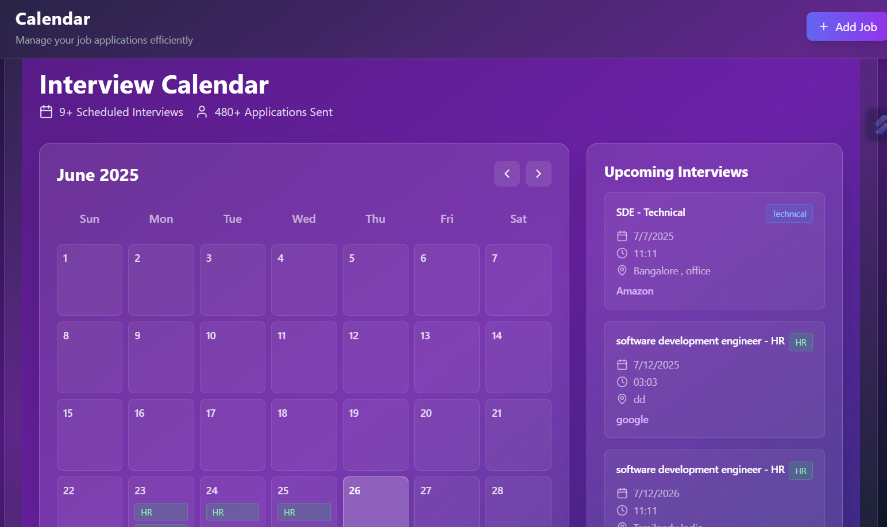

# 💼 Job Pilot - Job Tracking and Interview Management Tool

Job Pilot is a full-stack MERN application designed to help users efficiently manage their job applications and interviews. The app allows users to schedule interviews, add detailed information, and get instant notifications—streamlining the entire job-hunting process.

---

## 🎥 Demo

Here’s a quick preview of the Job Pilot UI:


> The app lets you add and manage interviews from a clean calendar UI, send email notifications, and track job rounds easily.

---

## 📸 Screenshots

<p align="center">
  
</p>

<p align="center">
  
</p>

<p align="center">
  
</p>

---

## 🚀 Features

- 📅 Add interviews with details like:
  - Title
  - Date & Time
  - Round (e.g., HR, Technical)
  - Location
  - Additional Notes
- 🗓️ Interactive calendar view to visualize interview schedule.
- 📧 Email notifications when a new interview is scheduled.
- 📊 Dashboard view for better job tracking.

---

## ⚙️ Technologies Used

- **Frontend:** React, Vite, Tailwind CSS
- **Backend:** Node.js, Express.js
- **Database:** MongoDB (with Mongoose)
- **Others:** Nodemailer, Render (for deployment), Vercel (for frontend)

---

## 🛡️ Future Enhancements

- 🛑 Improved security and route protection
- 🔔 Push Notifications via Email and Browser
- 📱 Mobile responsiveness enhancements

---

## 🧠 Learning Outcomes

This project helped me strengthen my skills in:

- Designing **scalable** and **modular** architecture in a MERN stack app
- Handling **real-world async communication** like email alerts
- Managing **state and routes** effectively in a large frontend app
- Understanding **backend deployment** using platforms like Render

---

## 🛠️ Installation & Setup

### 1. Clone the repository

```bash
git clone https://github.com/mdfaisal001/job-tracker.git
cd job-tracker
```

### 2. Setup Backend

```bash
cd server
npm install
npm run dev
```

Create a `.env` file inside the `/server` directory and configure:

```env
PORT=5000
MONGO_URI=your_mongodb_connection_string
EMAIL_USER=your_email@example.com
EMAIL_PASS=your_email_password
```

### 3. Setup Frontend

```bash
cd client
npm install
npm run dev
```

---

## 🤝 Contributing

Contributions are welcome!

1. Fork this repo
2. Create your feature branch:

```bash
git checkout -b feature/YourFeatureName
```

3. Commit your changes:

```bash
git commit -m "Add: Your feature summary"
```

4. Push to the branch:

```bash
git push origin feature/YourFeatureName
```

5. Open a pull request 🚀

---

## 📂 Folder Structure

```
job-tracker/
│
├── client/          # React frontend (Vite)
│   ├── src/
│   ├── public/
│
├── server/          # Express backend
│   ├── controllers/
│   ├── routes/
│   ├── models/
│   ├── utils/
│
└── README.md
```

---

## 📌 License

This project is open source and available under the [MIT License](LICENSE).

---

## 🔗 Links

- 🔥 Live Site: [Deployed App](https://job-tracker-piba.vercel.app/)
- 📬 Contact: [Linkedin](https://www.linkedin.com/in/mohammed-faisal-s-30690825b/)

---

## 🌟 Don’t forget to star the repo if you find it useful!

#MERNStack #WebDev #OpenSource #Nodejs #Reactjs #MongoDB #JobTracker
